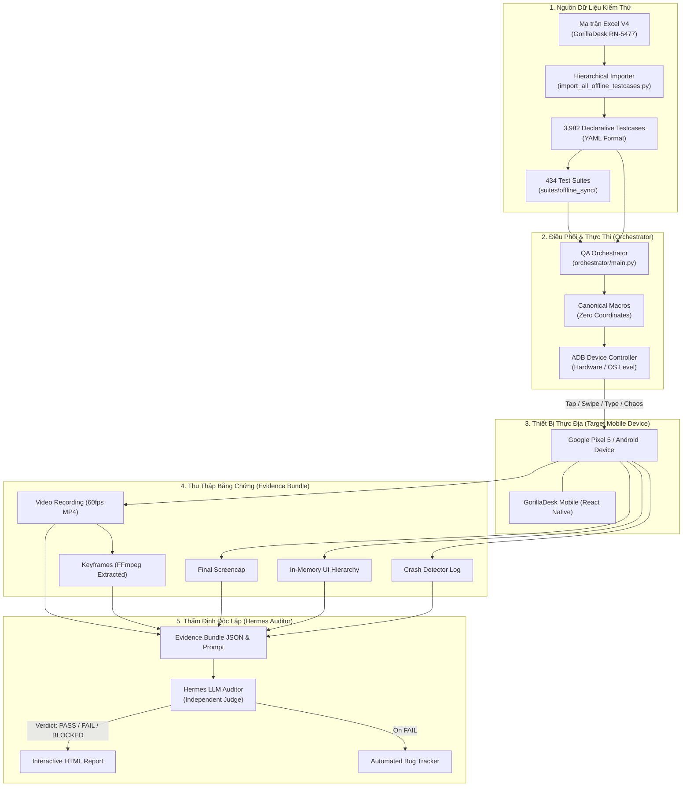

# 🦍 AI-QA: GorillaDesk Mobile Autonomous Testing & Offline-Sync Framework

[](https://www.python.org/)
[](https://reactnative.dev/)
[]()
[]()
[]()

> **Framework kiểm thử tự động hóa thông minh (Autonomous AI-QA) thế hệ mới chuyên sâu cho ứng dụng di động GorillaDesk (`com.gorilladesk.rn`), xây dựng trên kiến trúc điều phối 2 Agent độc lập (Dual-Agent: Artemis Runner & Hermes Auditor), hỗ trợ cơ chế định danh phần tử động 100% (Zero Hardcoded Coordinates) và bao phủ toàn diện 3,982+ kịch bản đồng bộ ngoại tuyến (Offline Sync Matrix).**

---

## 📑 Mục lục (Table of Contents)
1. [Giới thiệu tổng quan (Overview)](#1-giới-thiệu-tổng-quan-overview)
2. [Kiến trúc hệ thống Dual-Agent (System Architecture)](#2-kiến-trúc-hệ-thống-dual-agent-system-architecture)
3. [Các đặc tính nổi bật (Key Capabilities)](#3-các-đặc-tính-nổi-bật-key-capabilities)
4. [Phân loại kịch bản kiểm thử (Testcase Taxonomy)](#4-phân-loại-kịch-bản-kiểm-thử-testcase-taxonomy)
5. [Cấu trúc thư mục dự án (Directory Structure)](#5-cấu-trúc-thư-mục-dự-án-directory-structure)
6. [Yêu cầu môi trường & Cài đặt (Prerequisites & Installation)](#6-yêu-cầu-môi-trường--cài-đặt-prerequisites--installation)
7. [Hướng dẫn sử dụng chi tiết (Detailed Usage Guide)](#7-hướng-dẫn-sử-dụng-chi-tiết-detailed-usage-guide)
8. [Quy trình trích xuất bằng chứng (Evidence Bundle & Reports)](#8-quy-trình-trích-xuất-bằng-chứng-evidence-bundle--reports)
9. [Xử lý sự cố thường gặp (Troubleshooting)](#9-xử-lý-sự-cố-thường-gặp-troubleshooting)

---

## 1. Giới thiệu tổng quan (Overview)

Ứng dụng di động **GorillaDesk Mobile** phục vụ kỹ thuật viên thực địa (Field Technicians) trong các môi trường mạng phức tạp: tầng hầm, khu vực sóng yếu, hoặc hoàn toàn mất kết nối. Dữ liệu công việc (Jobs), khách hàng (Customers), báo giá (Estimates), hóa đơn (Invoices), chữ ký (Signatures) và định mức vật tư (Materials) phải được lưu trữ an toàn trong cơ sở dữ liệu cục bộ (SQLite/Realm) và tự động đồng bộ lên Cloud khi có mạng trở lại mà không được gây mất mát dữ liệu hoặc xung đột phiên bản.

**AI-QA Mobile Automation Framework** ra đời nhằm giải quyết bài toán kiểm thử tự động hóa khép kín:
- **Tự động hóa hoàn toàn trên thiết bị thật (Physical Device) và Emulator**: Thực thi tương tác trực quan 1-1 không phụ thuộc vào tọa độ cứng cố định.
- **Mô phỏng mạng chủ động (Active Network Chaos)**: Bật/tắt Wi-Fi, dữ liệu di động (Mobile Data), mạng chập chờn (Flapping), ngắt mạng giữa chừng (Mid-flight outage).
- **Thẩm định bằng chứng khách quan (Audited Evidence)**: Không chỉ dựa vào assertion log, hệ thống ghi hình video 60fps, trích xuất khung hình then chốt (Keyframes) và đẩy qua **Hermes Auditor** đánh giá chéo độc lập.

---

## 2. Kiến trúc hệ thống Dual-Agent (System Architecture)

Hệ thống hoạt động theo mô hình **Khép kín 2 Agent (Closed-Loop Dual-Agent)**:



### Vai trò của từng Agent:
1. **Agent 1: Artemis Runner (Observe-Think-Act)**
   - Nạp kịch bản kiểm thử, kiểm tra trạng thái màn hình hiện tại.
   - Định danh phần tử theo độ ưu tiên: `resource-id` $\to$ `content-desc` $\to$ `text` $\to$ Tọa độ tương đối dự phòng (`fallback_rel`).
   - Tự động bù trừ độ trễ mạng, xử lý trạng thái non-idle của animation offline và đưa ứng dụng về điểm bắt đầu an toàn (`ensure_calendar_home`).
2. **Agent 2: Hermes Auditor (Independent Verifier)**
   - Đọc hợp đồng kiểm thử (Test Contract) từ file YAML và đối chiếu trực tiếp với: Video quay thực tế, các ảnh Keyframes cắt theo từng mốc thời gian, cây UI XML cuối cùng và Logcat hệ thống.
   - Chặn đứng 100% rủi ro False Positive (báo pass ảo) hoặc Mismatch (kịch bản viết một đằng nhưng thực thi một nẻo).

---

## 3. Các đặc tính nổi bật (Key Capabilities)

### 🎯 1. Triết lý Định danh Động (Dynamic-First, Relative-Fallback)
- **100% Không dùng tọa độ pixel tuyệt đối:** Loại bỏ hoàn toàn lỗi vỡ test khi đổi kích thước màn hình hoặc chạy trên các dòng máy khác nhau.
- **Cơ chế Fallback thông minh:** Khi element bị che khuất hoặc thay đổi nhỏ về layout, hệ thống tự động suy ra vị trí theo tỷ lệ phần trăm biên màn hình (`relative boundaries`).

### ⚡ 2. Xử lý Trạng thái Non-Idle & Hiệu ứng Mất mạng
- Các ứng dụng React Native khi mất kết nối thường có icon đồng bộ xoay tròn hoặc banner offline cảnh báo nhấp nháy liên tục, khiến lệnh dump mặc định của Android bị kẹt `could not get idle state`.
- Hệ thống tối ưu hóa dump với timeout 3.5s, phân tích cây phân cấp trực tiếp trên bộ nhớ (`in-memory XML parsing`), giảm thời gian kiểm tra từ **37 giây xuống còn 1.5 giây**.

### 🎬 3. Chứng minh Thực thi bằng Video 60fps & Keyframes
- Tự động khởi chạy tiến trình `screenrecord` ngầm khi bắt đầu test case.
- Kết thúc test case, hệ thống gửi tín hiệu `SIGINT` để hoàn thiện header atom của MP4, sau đó tự động dùng `FFmpeg` bóc tách từ 3 đến 5 khung hình quan trọng nhất (Keyframes) làm bằng chứng cho báo cáo.

### 🛡️ 4. Tách biệt Hành động Nguyên tử (Atomic Explicit Steps)
- Không giấu thao tác trong các macro hộp đen khó debug.
- Mọi bước thao tác đều được khai báo rành mạch:
  ```text
  Bấm nút (+) ➔ Chọn New Job ➔ Chọn Khách hàng ➔ Chọn Địa điểm ➔ Chọn Dịch vụ ➔ Bấm Save
  ```
- Từng bước hiển thị rõ ràng trên Console Log, thời gian thực thi (latency), và trạng thái hoàn thành.

---

## 4. Phân loại kịch bản kiểm thử (Testcase Taxonomy)

Hệ thống bao phủ trọn vẹn **3,982 test cases** được phân cấp khoa học theo 11 phân hệ:

| Thư mục Suite | Số lượng | Trọng tâm kiểm thử (Verification Focus) |
| :--- | :---: | :--- |
| `01_online_to_offline` | 763 | Nạp dữ liệu online $\to$ ngắt mạng đột ngột $\to$ tiếp tục thao tác tạo mới / chỉnh sửa ngoại tuyến. |
| `02_offline_to_online` | 1,324 | Thao tác khi đang mất mạng $\to$ khôi phục kết nối $\to$ kiểm tra Outbox Sync Queue đẩy dữ liệu lên server. |
| `03_round_trip` | 441 | Chu kỳ đóng/mở mạng nhiều lần liên tục (Multi-transition outage) kèm khởi động lại app. |
| `04_server_to_local_offline` | 150 | Kiểm tra khả năng lưu trữ cục bộ khi dữ liệu từ máy chủ đẩy về thiết bị. |
| `05_cross_cutting` | 641 | Xung đột đa thiết bị (Multi-device), chuyển chi nhánh (Branch switch), đổi tài khoản (Account switch). |
| `09_new_twoway_delta` | 72 | Các hành động xóa (Delete), phục hồi hai chiều phát sinh từ delta scope. |
| `10_dev_checklist_167` | 167 | Bộ kiểm tra đối soát trực tiếp theo checklist lập trình viên Mobile. |
| `11_bug_regression_91` | 91 | Kiểm thử hồi quy toàn bộ danh mục lỗi lịch sử của GorillaDesk Mobile. |
| `12_perf_rerender_245` | 245 | Đánh giá hiệu năng, giật lag (frame drop), rò rỉ bộ nhớ (leak) khi render danh sách lớn offline. |
| `13_jira_current_delta` | 48 | Các yêu cầu nghiệp vụ bổ sung từ Jira comments và schema migrations. |
| `16_production_edge_gaps` | 40 | Các ca biên rủi ro cao thu thập từ môi trường vận hành thực tế. |
| **TỔNG CỘNG** | **3,982** | **Bảo đảm 100% phạm vi nghiệp vụ ngoại tuyến của GorillaDesk** |

---

## 5. Cấu trúc thư mục dự án (Directory Structure)

```text
AI_MobileApp/
├── .gitignore               # Bộ lọc loại trừ video nặng, temp dump và cache
├── README.md                # Tài liệu hướng dẫn sử dụng toàn diện
└── ai-qa/
    ├── adapters/            # Kết nối phần cứng và Agent
    │   ├── adb.py           # Điều khiển thiết bị Android qua ADB, ghi hình video, trích keyframes
    │   ├── artemis.py       # Tích hợp Agent nhận thức thị giác Artemis
    │   └── bug_tracker.py   # Tự động xuất file bug khi test fail
    ├── config/              # Cấu hình môi trường, tài khoản và thiết bị
    ├── core/
    │   └── canonical_macros.py # Động cơ thao tác nghiệp vụ chuẩn (Calendar, Job, Customer, Status...)
    ├── datasets/            # Dữ liệu kiểm thử mẫu (Khách hàng, Lộ trình, Kỹ thuật viên)
    ├── evaluators/          # Bộ thẩm định kết quả
    │   ├── crash_detector.py # Giám sát Logcat bắt lỗi Fatal/Crash/ANR
    │   └── hermes_judge.py  # Giao tiếp với Hermes Auditor đánh giá chéo
    ├── knowledge/           # Cơ sở tri thức nghiệp vụ (Playbook, UI Screens, Rules)
    │   ├── screens/         # Ảnh chụp mẫu và cây XML của các màn hình chính
    │   └── GORILLADESK_SYSTEM_LOGIC_AND_PRODUCT_KNOWLEDGE.md
    ├── orchestrator/        # Trình điều phối trung tâm
    │   ├── loader.py        # Nạp kịch bản YAML và bộ Suite
    │   ├── main.py          # Entry point chính chạy test và gọi Hermes
    │   └── result_normalizer.py # Chuẩn hóa kết quả kiểm thử
    ├── reports/             # Báo cáo đầu ra (HTML Reports, JSON Runs, Bug Logs)
    ├── suites/              # 434 bộ Suite kiểm thử phân cấp theo từng nhóm chức năng
    │   ├── offline_sync/    # Phân cấp chi tiết theo từng Sheet
    │   └── pilot-6-representative.yaml # Bộ 6 testcase tiêu biểu
    ├── testcases/           # Kho lưu trữ 3,982 kịch bản kiểm thử YAML
    │   └── offline_sync/
    │       ├── 01_online_to_offline/ (calendar/, job/, customer/, estimate/...)
    │       ├── 02_offline_to_online/
    │       └── ...
    └── tools/               # Bộ công cụ tự động hóa & generator
        ├── import_all_offline_testcases_hierarchical.py # Generator sinh 3,982 testcase từ Excel
        └── extract_all_selectors.py # Trích xuất selector động từ file dump
```

---

## 6. Yêu cầu môi trường & Cài đặt (Prerequisites & Installation)

### 1. Phần cứng & Phần mềm yêu cầu:
- **Hệ điều hành:** Windows 10/11, macOS, hoặc Linux.
- **Python:** Phiên bản `3.10` trở lên (Khuyến nghị Python 3.11 hoặc 3.12).
- **Android SDK Platform-Tools:** Chứa binary `adb.exe` chính thức.
- **FFmpeg & FFprobe:** Đã cài đặt và nằm trong biến môi trường `PATH` (dùng để cắt video keyframes).
- **Thiết bị Android:** Điện thoại vật lý (Google Pixel 5, Pixel 6, Samsung...) hoặc Android Emulator (API 33/34).

### 2. Thiết lập thiết bị Android:
1. Bật **Developer Options (Tùy chọn cho nhà phát triển)** $\to$ Kích hoạt **USB Debugging**.
2. Kết nối máy tính qua cáp USB và chọn **Always allow from this computer** trên màn hình điện thoại.
3. Tắt Animation hệ thống để tránh Android bị kẹt trạng thái non-idle:
   ```bash
   adb shell settings put global window_animation_scale 0
   adb shell settings put global transition_animation_scale 0
   adb shell settings put global animator_duration_scale 0
   ```
4. Kiểm tra thiết bị đã kết nối thành công:
   ```bash
   adb devices -l
   # Kết quả mẫu:
   # 0B171FDD4005K3   device product:redfin model:Pixel_5
   ```

### 3. Cài đặt thư viện Python:
Mở terminal tại thư mục gốc của repository:
```bash
cd AI_MobileApp/ai-qa
pip install -r requirements.txt
```
*(Các thư viện chính bao gồm: `pyyaml`, `openpyxl`, `requests`)*

---

## 7. Hướng dẫn sử dụng chi tiết (Detailed Usage Guide)

### 1. Chạy một Test Case đơn lẻ (Single Test Run)
Chạy một ca kiểm thử cụ thể (ví dụ ca tạo Job offline `SYNC-00365`) và kích hoạt **Hermes Judge** thẩm định tự động:
```bash
python ai-qa/orchestrator/main.py --test SYNC-00365 --judge hermes
```
Nếu chỉ muốn chạy thực thi nhanh trên máy mà không gọi Hermes thẩm định:
```bash
python ai-qa/orchestrator/main.py --test SYNC-00365 --judge none
```

### 2. Chạy theo bộ Suite kiểm thử (Suite Run)
Chạy bộ Suite kiểm thử ngoại tuyến của phân hệ Job trong Sheet 01:
```bash
python ai-qa/orchestrator/main.py --suite offline-01-job
```
Chạy giới hạn số lượng testcase trong suite (ví dụ chỉ chạy 3 case đầu tiên):
```bash
python ai-qa/orchestrator/main.py --suite offline-01-job --limit 3
```
Chạy bộ 6 ca kiểm thử đại diện (Pilot Suite):
```bash
python ai-qa/orchestrator/main.py --suite pilot-6-representative
```

### 3. Chỉ định thiết bị cụ thể khi có nhiều máy kết nối
Khi máy tính cắm đồng thời nhiều điện thoại hoặc emulator, dùng tham số `--device`:
```bash
python ai-qa/orchestrator/main.py --test SYNC-00365 --device 0B171FDD4005K3
```

### 4. Tái sinh toàn bộ kho 3,982 testcase từ Ma trận Excel
Khi file ma trận nghiệp vụ Excel (`GorillaDesk_RN-5477_Full_Current_Scope_QA_V4.xlsx`) có cập nhật mới, chạy lệnh sau để tái sinh toàn bộ 3,982 file YAML và 434 bộ Suite:
```bash
python ai-qa/tools/import_all_offline_testcases_hierarchical.py
```

---

## 8. Quy trình trích xuất bằng chứng (Evidence Bundle & Reports)

Mỗi lần một testcase được thực thi, hệ thống tự động xuất ra một bộ bằng chứng toàn diện tại thư mục `ai-qa/runs/`:

1. **🎬 Video Full-HD 60fps:** `ai-qa/runs/videos/<TC_ID>.mp4` — Ghi lại toàn bộ thao tác từ lúc nạp dữ liệu đến khi lưu offline và kiểm tra kết quả.
2. **🖼️ Keyframes then chốt:** `ai-qa/runs/keyframes/<TC_ID>_keyframe_*.png` — Các khung hình được trích xuất đều theo dòng thời gian chứng minh từng bước chuyển màn hình.
3. **📄 Dữ liệu bằng chứng JSON:** `ai-qa/runs/<TC_ID>_evidence.json` — Chứa danh sách bước đã chạy, thời lượng từng bước, trạng thái Crash Detector, và các chuỗi text nhìn thấy trên màn hình.
4. **📝 Prompt thẩm định cho Hermes:** `ai-qa/runs/<TC_ID>_FOR_HERMES.md` — Bản mô tả chi tiết kèm quy tắc chấm điểm (Rubric) dành cho Agent kiểm định độc lập.
5. **📊 Báo cáo HTML trực quan:** `ai-qa/reports/html/<TC_ID>_<TIMESTAMP>.html` — Báo cáo giao diện web hiện đại, cho phép xem lại video, danh sách keyframes và lý do phán quyết của Hermes.

---

## 9. Xử lý sự cố thường gặp (Troubleshooting)

### 🔴 Lỗi: `* daemon not running; starting now at tcp:5037` lặp lại liên tục
- **Nguyên nhân:** Có nhiều bản `adb.exe` khác nhau trên máy (ví dụ bản của Scrcpy trong WinGet và bản của Android SDK) tranh chấp cổng 5037.
- **Khắc phục:** Đảm bảo hệ thống sử dụng duy nhất bản ADB của Android SDK. Khởi động daemon nền ổn định bằng lệnh:
  ```powershell
  Start-Process -FilePath "C:\Users\Admin\AppData\Local\Android\Sdk\platform-tools\adb.exe" -ArgumentList "start-server" -WindowStyle Hidden
  ```

### 🔴 Lỗi: `ERROR: could not get idle state` khi dump UI
- **Nguyên nhân:** Màn hình ứng dụng có icon đồng bộ xoay tròn hoặc animation nhấp nháy liên tục khi mất mạng.
- **Khắc phục:** Đặt các chỉ số scale animation hệ thống về 0 qua ADB:
  ```bash
  adb shell settings put global window_animation_scale 0
  adb shell settings put global transition_animation_scale 0
  adb shell settings put global animator_duration_scale 0
  ```

### 🔴 Lỗi: Nhấn Back cứng trên Android làm vỡ luồng màn hình (React Native Stack)
- **Nguyên nhân:** Sau khi tạo Job hoặc Customer, lệnh `adb.back()` (keyevent 4) có thể pop ngược vào giữa wizard thay vì về trang chính.
- **Khắc phục:** Không dùng keyevent 4 bừa bãi. Sử dụng macro `ensure_calendar_home` hoặc nhấn trực tiếp nút Header Back (`highlight-button`).

---

## 👨‍💻 Tác giả & Đóng góp (Author)
- **Lead Engineer & Maintainer:** [DucHieu2711](https://github.com/hieutranduc2711)
- **Dự án:** GorillaDesk Mobile QA Automation (`com.gorilladesk.rn`)
- **Nền tảng:** React Native • Android • ARTEMIS & Hermes Dual-Agent Framework
