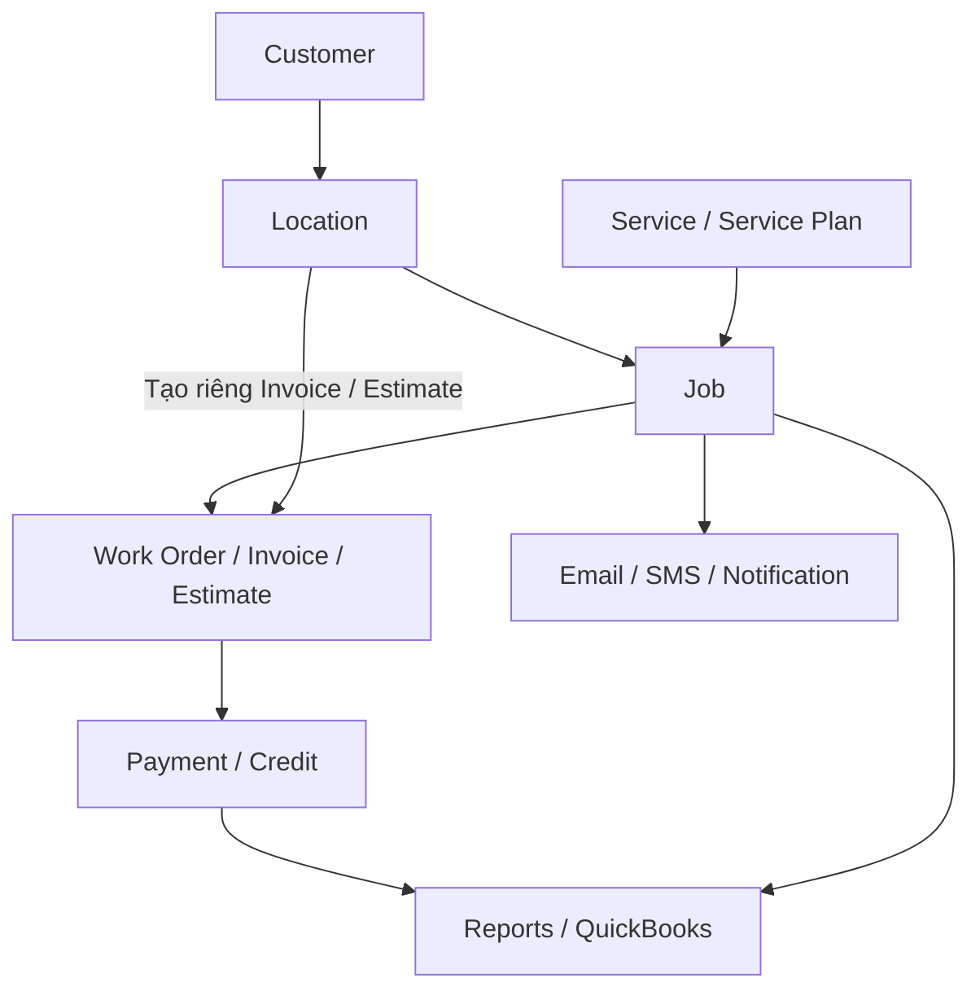
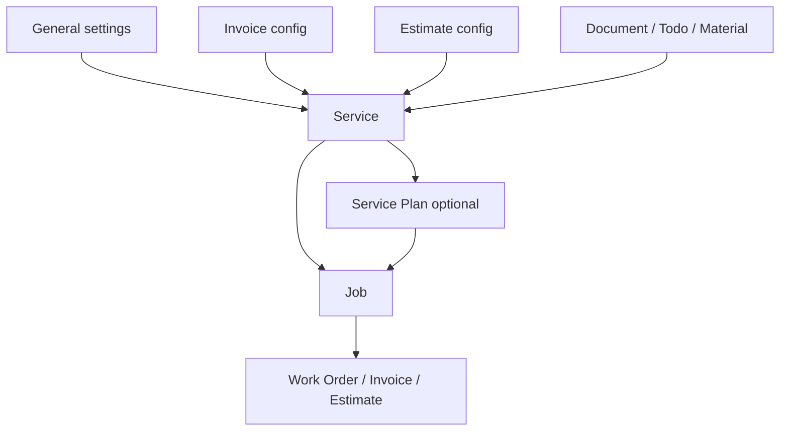

# GorillaDesk System Logic & Product Knowledge

> Phiên bản tổng hợp: 2026-08-18  
> Phạm vi dữ liệu nguồn: dự án `web_ai_qa_assistant(2)` đến 2026-07-28 và các tài liệu team cung cấp: `Logic GorillaDesk (1).docx`, `Customer.docx`, `Service(1).docx`.  
> Nội dung: kiến thức sản phẩm, entity, quan hệ, business rule, flow, trạng thái và dependency của GorillaDesk.

---

## 1. Mức độ xác nhận của thông tin

| Nhãn | Ý nghĩa |
|---|---|
| `[Tester Confirmed]` | Tester đã xác nhận trực tiếp |
| `[Guide Confirmed]` | Được ghi nhận trong tài liệu/hướng dẫn GorillaDesk đã tổng hợp trong dự án |
| `[UI Observed]` | Đã quan sát trên giao diện hoặc evidence của dự án |
| `[Probe Passed]` | Flow đã được thực hiện và có kết quả kiểm tra thành công |
| `[Changed Behavior]` | Hành vi mới khác evidence hoặc hiểu biết cũ |
| `[Provided Logic]` | Có trong các file logic Word do team cung cấp, nhưng chưa được đối chiếu độc lập với Guide/UI/Tester |
| `[Conflict]` | Hai nguồn hoặc hai mô tả đưa ra kết quả không thể đồng thời đúng; chưa chọn bên nào làm rule |
| `[Unconfirmed]` | Chưa đủ dữ liệu hoặc còn mâu thuẫn, cần xác nhận thêm |

---

## 2. Tổng quan hệ thống GorillaDesk

GorillaDesk là hệ thống quản lý hoạt động dịch vụ hiện trường. Nền tảng liên kết hồ sơ khách hàng, địa điểm phục vụ, dịch vụ, lịch làm việc, vòng đời công việc, giấy tờ, thanh toán, báo cáo, giao tiếp khách hàng và các hệ thống tích hợp.

Chuỗi dữ liệu nghiệp vụ chính:

Thay đổi ở dữ liệu đầu nguồn có thể ảnh hưởng nhiều phần phía sau. Ví dụ, chọn sai Location có thể làm sai địa chỉ thực hiện Job, thông tin `service-to`, `bill-to`, người nhận giấy tờ, lịch tuyến đường và báo cáo.

`[Tester Confirmed]` Invoice/Estimate thực tế có thể đi theo flow Job hoặc được tạo/quản lý trực tiếp ở Customer/Location. Invoice/Estimate tạo riêng không có `job_id`. Cấu hình Invoice/Estimate nằm trong Service chỉ là cấu hình mẫu tùy chọn, không phải bản thân chứng từ thực tế.

---

## 3. Thuật ngữ chính

| Thuật ngữ | Ý nghĩa |
|---|---|
| Customer | Hồ sơ khách hàng hoặc công ty chính |
| Location | Địa điểm cung cấp dịch vụ hoặc địa chỉ liên quan đến billing |
| Contact | Người hoặc thông tin liên hệ thuộc Customer/Location |
| Service | Mẫu dịch vụ dùng làm dữ liệu đầu vào cho Job |
| Service Invoice/Estimate Configuration | Cấu hình mẫu tùy chọn nằm trong Service; khác với Invoice/Estimate record thực tế |
| Service Plan | Kế hoạch/chuỗi dịch vụ gồm một hoặc nhiều Service |
| Job | Một lần thực hiện công việc cho khách hàng tại thời gian cụ thể |
| Schedule | Thông tin xếp lịch của Job theo ngày, giờ và nhân viên |
| Calendar Slot | Khoảng thời gian dùng để tạo hoặc di chuyển Job |
| Recurring Job | Job lặp lại theo chu kỳ |
| Work Order | Phiếu công việc dùng cho hoạt động thực hiện dịch vụ |
| Invoice | Hóa đơn/chứng từ tính tiền |
| Estimate | Báo giá hoặc đề xuất gửi khách hàng |
| Line Item | Một dòng hàng hóa/dịch vụ có số lượng và giá |
| Payment | Khoản tiền đã nhận hoặc đã apply vào Invoice |
| Credit | Số tiền có sẵn trên Customer để apply vào Invoice |
| Customer Activity | Note, Top Note, Task, Email, Call, SMS hoặc log gắn với Customer |
| Top Note | Ghi chú quan trọng ở Customer có thể được hiển thị trên các Job của Customer |
| Refund | Khoản tiền hoàn lại cho khách hàng |
| Trigger | Quy tắc tự động chạy hành động khi điều kiện hoặc sự kiện xảy ra |
| Processor | Hệ thống xử lý tiền như Stripe hoặc Square |
| Mapping | Ghép một record GorillaDesk với record tương ứng ở hệ thống khác |
| Draft | Trạng thái bản nháp |
| Pending | Đang chờ xử lý hoặc xác nhận |
| Void | Vô hiệu hóa chứng từ/giao dịch theo rule hệ thống |
| Write-off | Ghi nhận khoản phải thu không còn thu hồi |
| Propagation | Việc dữ liệu/cấu hình truyền từ entity này sang entity khác |
| Work Pool | Khu vực chứa Job chưa được đặt cố định vào lịch/technician |
| Time Window | Khoảng giờ dự kiến đến, ví dụ 8:00–12:00, thay vì một giờ cố định |
| Route Optimizer | Công cụ sắp xếp lại thứ tự Job để tối ưu tuyến đường |
| Drive Matrix Connection | Đơn vị tài nguyên dùng để tính tuyến theo dữ liệu đường thực tế |
| Unit | Điểm/khu vực nhỏ bên trong một Location, như phòng, căn hộ hoặc bait station |
| Device | Thiết bị/bẫy cần được kiểm tra và ghi nhận kết quả tại hiện trường |
| Time Entry | Một phiên Clock In–Clock Out của nhân viên |
| Production Commission | Hoa hồng theo người trực tiếp thực hiện công việc |
| Sold By Commission | Hoa hồng theo người bán/chốt dịch vụ |
| IVR | Menu phím bấm tự động khi khách gọi vào tổng đài |

---

## 4. Entity và quan hệ dữ liệu

### 4.1 Customer, Location và Contact

| Entity | Dữ liệu và vai trò | Quan hệ chính |
|---|---|---|
| Customer | Identity, contact, source, tags, custom fields, balance, cards/banks, statement, task và communication history | Là hồ sơ gốc của Location, Job, Invoice, Estimate, Payment và Portal |
| Location | Service/billing address, billing email, tax, payment terms, tags, unit và messaging preference | Được chọn khi tạo Job, Invoice, Estimate và ảnh hưởng route/report |
| Contact | Email, phone, SMS number, preference và vai trò người nhận | Có thể là người đặt lịch hoặc người nhận Invoice, SMS, reminder, Work Order |
| Billing Email | Email nhận Invoice, Statement hoặc giao tiếp thanh toán | Có thể thuộc Customer/Location; thứ tự ưu tiên còn chưa xác nhận |
| Customer Activity | Note, Top Note, Task, Email, Call, SMS, system log và financial log | Lưu lịch sử tương tác, follow-up và sự kiện của Customer |

Customer có thể có một hoặc nhiều Location. Customer là identity chính nhưng nhiều flow vận hành và billing cần Location cụ thể.

### 4.2 Service và Service Plan

| Entity | Dữ liệu và vai trò | Quan hệ chính |
|---|---|---|
| Service | Name, duration, repeat, summary, job cycle, color và các cấu hình con | Là template đầu vào khi tạo Job |
| Service Invoice Configuration | Cấu hình mẫu tùy chọn gồm item, cost, tax, quantity, price, discount, terms, notes | Có thể điền nội dung Invoice; không phải Invoice record thực tế |
| Service Estimate Configuration | Cấu hình mẫu tùy chọn gồm type, template, item, discount, deposit, terms, notes | Có thể điền nội dung Estimate; không phải Estimate record thực tế |
| Service Document | Tài liệu/PDF được gắn vào Service | Có thể được đưa vào giấy tờ hoặc Job tùy cấu hình |
| Service Todo List | Danh sách việc cần làm thuộc Service | Có thể cấu hình trong Service Template hoặc thêm trực tiếp vào Job đã tạo |
| Material Usage | Material, unit, dilution, location, target | Khi add-on bật, có thể cấu hình trong Service Template hoặc thêm trực tiếp vào Job đã tạo |
| Service Plan | Initial service, next service và chuỗi Service | Có thể điều khiển các dịch vụ tiếp theo trong vòng đời plan |

### 4.3 Job và Schedule

| Entity | Dữ liệu và vai trò | Quan hệ chính |
|---|---|---|
| Job | Customer, Location, Service/Plan, date, time, duration, technician, status, notes | Trung tâm của hoạt động dịch vụ hiện trường |
| Schedule | Ngày, giờ, assignee và lịch làm việc | Quyết định Job xuất hiện ở đâu trên Calendar |
| Calendar Slot | Khoảng thời gian và technician context | Dùng làm điểm đặt hoặc di chuyển Job |
| Job Status | Trạng thái vòng đời Job | Tác động recurring chain, trigger, report và communication |
| Recurring Job | Job hiện tại và các lần lặp tiếp theo | Complete, Cancel, Move, Delete hoặc Terminate có thể tác động cả chuỗi |

### 4.4 Paperwork

| Entity | Dữ liệu và vai trò | Quan hệ chính |
|---|---|---|
| Work Order | Nội dung công việc, service info, notes và recipient | Liên kết với Job, Customer và Location |
| Invoice | Status, line items, tax, discount, total, balance và Job link nếu có | Record tạo riêng không có `job_id`; record theo Job có thể liên kết Job, Payment, Credit, Report, Processor và QuickBooks |
| Estimate | Status, type, package, deposit, e-sign và Job link nếu có | Record tạo riêng không có `job_id`; có thể chuyển thành Invoice hoặc tạo Job tùy flow |
| Line Item | Name, quantity, cost, price, tax và discount | Dùng tính tổng Invoice/Estimate |
| Tax | Rate hoặc tax group | Tác động total và QuickBooks mapping |
| Discount | Fixed hoặc percentage | Tác động total và accounting mapping |

### 4.5 Financial entities

| Entity | Dữ liệu và vai trò | Quan hệ chính |
|---|---|---|
| Payment | Method, amount, Invoice, Customer, receipt và processor | Thay đổi Invoice balance/status và Customer balance |
| Credit | Credit amount và Invoice được apply | Có thể tồn tại trên Customer trước khi apply |
| Refund | Processor refund và dữ liệu Payment trong GD | Tác động Invoice, Report và QuickBooks |
| Stripe Card | Payment method lưu qua Stripe | Dùng payment, Pay Online, subscription hoặc trigger |
| Square Card | Payment method lưu qua Square | Có khác biệt khả năng giữa desktop và mobile |
| ACH Bank | Bank account và trạng thái verification/payment | Dùng thanh toán qua Stripe ACH |

### 4.6 Communication, Report và Integration

| Entity | Dữ liệu và vai trò | Quan hệ chính |
|---|---|---|
| Email | Template, variables, recipient và delivery status | Dùng cho Job, Invoice, WO, Estimate, receipt và reminders |
| SMS | Template, variables, recipient và SMS credits | Dùng xác nhận, nhắc lịch, giấy tờ và thông báo |
| Notification | Alert dành cho user/team/customer | Có thể phụ thuộc permission và setting |
| Report | Filter, columns, totals, export và batch actions | Đối chiếu dữ liệu vận hành/tài chính; một số action làm thay đổi dữ liệu |
| Trigger | Condition, event và action | Có thể gửi communication, charge card hoặc apply credit |
| Portal User | Tài khoản khách hàng trên Portal | Truy cập paperwork, payment method, booking và payment |
| Online Booking | Submission dịch vụ/thời gian từ khách hàng | Có thể liên kết Customer hoặc tạo Lead/Pending Job |
| QuickBooks ID | ID ghép Customer GD với Customer QBO | Quyết định Invoice/Payment được sync tới Customer nào |

---

## 5. Logic Customer và Location

### 5.1 Customer creation

- `[UI Observed]` Flow cơ bản: `Customers → New Customer → New Customer panel → nhập dữ liệu → Save → Customer xuất hiện trong danh sách`.
- `[Probe Passed]` Customer creation từng được xác minh bằng việc tìm thấy Customer sau Save.
- `[UI Observed]` Account # có xuất hiện trong dữ liệu Customer sau khi tạo ở các run hiện có.
- `[Unconfirmed]` Account # có luôn được hệ thống tự tạo trong mọi context hay không.
- `[Unconfirmed]` Danh sách field bắt buộc chính thức.
- `[Unconfirmed]` Last Name có luôn optional hay không.
- `[Unconfirmed]` Service Address yêu cầu đầy đủ street/city/state/zip hay cho phép địa chỉ một phần.
- `[Unconfirmed]` Duplicate Customer được phát hiện theo name, email, phone hay kết hợp nhiều field.
- `[Unconfirmed]` Sau Save luôn quay về Customers list hay có thể redirect khác theo setting.

### 5.2 Customer–Location dependency

- Customer là hồ sơ gốc; Location là context địa điểm cụ thể.
- Location có thể quyết định địa chỉ phục vụ, địa chỉ billing và recipient của giấy tờ.
- Job, Invoice và Estimate cần dùng đúng Location để tránh sai dữ liệu downstream.
- Thay đổi/merge/delete Customer hoặc Location có thể tác động Job, Invoice, Payment, Report, Portal và integration.
- `[Unconfirmed]` Thứ tự ưu tiên Customer email, Location email và Billing Email khi gửi từng loại giấy tờ.

### 5.3 Customer Detail và các module con

- `[Provided Logic]` Customer Detail là bề mặt trung tâm của một Customer, tập hợp identity, Locations, Contacts, Notes/activity, Jobs, Invoices, Estimates, Payments, Credits, Documents, payment methods, Portal access và communication history.
- `[Provided Logic]` Tab Account quản lý status, name, email, nhiều phone number, company, source, tags và custom fields; tài liệu cũng mô tả thao tác Add/Edit/Delete thẻ thanh toán lưu trên Customer.
- `[Provided Logic]` Contacts có thể đại diện cho người đặt lịch, người nhận Invoice/SMS/reminder/Work Order hoặc contact phụ.
- `[Provided Logic]` Các tab Jobs, Invoices, Estimates, Payments, Credits và Documents quản lý các record gắn với Customer; Invoice/Estimate thực tế vì vậy cần được phân biệt với cấu hình mẫu cùng tên nằm trong Service.
- `[Unconfirmed]` Quyền theo role, field bắt buộc và processor behavior khi quản lý stored payment methods từ Customer Account.

### 5.4 Location identity và default

- `[Provided Logic]` Service Address là địa điểm thực tế nơi technician thực hiện dịch vụ; chọn sai Location có thể đưa technician tới sai nơi.
- `[Provided Logic]` Billing Address có thể giống Service Address bằng tùy chọn `Same`, hoặc dùng địa chỉ billing riêng; Billing Email sai có thể làm Invoice/Statement gửi sai người hoặc không gửi được.
- `[Provided Logic]` Một Customer phải có ít nhất một Location; không được xóa Location cuối cùng.
- `[Provided Logic]` Location Tags dùng phân loại địa điểm; Invoice Tags dùng gắn nhãn cho Invoice liên quan đến Location. Hai nhóm tag có thể được dùng trong Smart Views và không nên coi là cùng một loại tag.
- `[Provided Logic]` Location có thể chứa Unit/sub-location; khi tạo hoặc xử lý Job cần chọn đúng Unit.
- `[Provided Logic]` Location có Appointment Messaging Preferences và Work Order Email để định hướng communication theo địa điểm.
- `[Provided Logic]` Tax và Payment Terms tại Location được mô tả là default tài chính cho Invoice phát sinh ở Location đó.
- `[Provided Logic]` Property Estimation tại Location hỗ trợ mở map để đo/ước lượng area hoặc khu vực cần xử lý.
- `[Unconfirmed]` Thứ tự ưu tiên giữa Location tax/terms/tags/email và default từ Customer, Service, Invoice template hoặc company settings.

### 5.5 Notes và activity timeline

- `[Provided Logic]` Activity Action Bar cho phép tạo Note, Task, Email, Call và SMS mà không rời Customer Detail.
- `[Provided Logic]` Note thông thường chỉ hiển thị trong thông tin Customer; Top Note là ghi chú nổi bật và được mô tả là hiển thị trên các Job của Customer.
- `[Provided Logic]` Task dùng cho follow-up; Call có thể `Log a Call` hoặc chọn phone/contact; SMS dùng cho trao đổi, nhắc lịch, xác nhận và link.
- `[Provided Logic]` Activity có thể lọc theo loại và khoảng ngày.
- `[Provided Logic]` Timeline có cả activity do người dùng tạo và system/financial logs, ví dụ recurring Invoice, Payment failed/deleted hoặc Customer authentication failed.
- `[Unconfirmed]` Top Note hiển thị trên mọi Job cũ/mới hay chỉ một phạm vi Location/thời gian nhất định; quyền xem thông tin nhạy cảm cũng chưa được xác nhận.

---

## 6. Logic Service và Service Plan

### 6.1 Service General

- `[UI Observed]` Service Templates có ba view: Active, Archived và Deleted.
- `[UI Observed]` Service list có Search, export, Add Service, row selection và bulk actions.
- `[UI Observed]` Add Service route là `/settings/service/add` trong UI đã discovery.
- `[UI Observed]` General gồm Service Name, Length, Repeat, Summary, Set to Confirmed, Job Cycle và Color.
- `[UI Observed]` Repeat hỗ trợ Off, Daily, Weekly, Monthly và Yearly.
- `[Tester Confirmed]` Summary do hệ thống tự sinh từ Repeat.
- `[Tester Confirmed]` Repeat = `Off` tạo Summary = `Once`.
- `[UI Observed]` Monthly và Yearly có Repeat By, Ends, Except và generated summary.
- `[UI Observed]` Duration hour từ 0 đến 12; minute từ 0 đến 55 theo bước 5 phút.
- `[UI Observed]` Color hỗ trợ hex/RGB và 15 màu preset.
- `[Unconfirmed]` Required-field rules, Job Cycle bounds và validation chính thức.

### 6.2 Service child configurations

- `[UI Observed]` Service có các entry point Add Invoice, Add Estimate, Add Document và Add Todo List.
- `[Provided Logic]` Invoice và Estimate trong Service là các cấu hình con tùy chọn. Về mặt tồn tại, Service có thể không có cả hai, chỉ có Invoice, chỉ có Estimate hoặc có cả Invoice và Estimate.
- `[Provided Logic]` Cụm “Invoice/Estimate trong Service” chỉ cấu hình dữ liệu mặc định cho Service và phụ thuộc các nguồn như Line Items, Taxes, Terms/Notes templates; không đồng nghĩa đã có Invoice/Estimate record của một Customer.
- `[UI Observed]` Invoice có Item, Cost, Tax, Qty, Price, one-time behavior, Description, Subtotal, Discount, Taxes, Total, Balance Due, Terms và Notes.
- `[UI Observed]` Estimate có Basic, Dynamic và Package.
- `[UI Observed]` Basic Estimate có Template, items, discount, deposit, Terms và Notes.
- `[UI Observed]` Dynamic Estimate đánh dấu initial item là Required.
- `[UI Observed]` Package Estimate có nhiều section Package Name, Add Package và Delete Package.
- `[UI Observed]` Chuyển từ Dynamic sang Package có bước confirmation.
- `[UI Observed]` Document mở Docs/PDF picker; khi chọn, row chuyển active, ẩn Add và hiện Remove trước khi Save.
- `[UI Observed]` Todo List mở textarea editor trực tiếp; chưa quan sát thấy template picker.
- `[Tester Confirmed]` Todo List có thể được cấu hình sẵn trong Service Template hoặc bổ sung trực tiếp vào Job sau khi Job đã được tạo.
- `[Unconfirmed]` Numeric bounds của cost, quantity, discount và deposit.
- `[Unconfirmed]` Tax calculation, template payload và line-item suggestion semantics.

### 6.3 Material Usage

- `[Tester Confirmed]` Material Usage đang bật trong account discovery.
- `[UI Observed]` Chọn Material sẽ điền unit và dilution.
- `[UI Observed]` Location và Target là searchable multi-select.
- `[UI Observed]` Add-ons từng hiển thị Documents, Dynamic Estimates, Material Usage và Service Plans.
- `[Tester Confirmed]` Material có thể được thêm ở hai thời điểm: cấu hình sẵn trong Service Template hoặc bổ sung trực tiếp vào Job sau khi Job đã được tạo.
- `[Tester Confirmed]` Khu vực thêm Material trong Service Template chỉ xuất hiện khi Material Usage Add-on đã được bật; vì vậy account chưa bật add-on sẽ không thấy entry point này.

### 6.4 Service Plan

- `[Tester Confirmed]` Service Plan có thể kết hợp nhiều Service.
- `[Tester Confirmed]` Job có thể dùng Service hoặc Service Plan.
- `[Guide Confirmed]` Khi một bước của Service Plan hoàn tất, hệ thống có thể kích hoạt service tiếp theo.
- `[Changed Behavior]` Account từng bị chặn `/settings/service_plans`, nhưng discovery sau đã truy cập được danh sách.
- `[Unconfirmed]` Add Plan editor chưa được mapping đầy đủ vì control từng timeout.
- `[Unconfirmed]` Activation, completion, terminate và delete tác động thế nào đến toàn bộ chuỗi plan.

### 6.5 Service propagation

- Service là template đầu vào cho Job.
- Service có thể có hoặc không có Invoice/Estimate configuration.
- Job tạo từ Service/Plan có thể liên kết Work Order, Invoice và Estimate.
- Sơ đồ trên chỉ mô tả flow đi qua Service/Job; Invoice/Estimate record còn có thể được tạo riêng ở Customer/Location mà không cần Service có cấu hình tương ứng.
- `[Unconfirmed]` Field nào được copy cố định và field nào tiếp tục tham chiếu Service.
- `[Unconfirmed]` Việc sửa Service có ảnh hưởng Job đã tạo trước đó hay chỉ Job mới.
- `[Unconfirmed]` Điều kiện chính xác để Service tạo Invoice Draft hoặc Estimate Draft trên Job.
- `[Unconfirmed]` Khi Material/Todo đã được cấu hình trong Service Template, cơ chế copy/snapshot sang Job và ảnh hưởng của việc sửa template sau đó vẫn chưa được xác nhận đầy đủ.
- `[Provided Logic]` Item dùng trong Service Invoice/Estimate lấy từ Line Items; Tax lấy từ Taxes; Terms/Notes có thể lấy từ Templates.
- `[Provided Logic]` Material gốc được quản lý trong Add-ons > Material Usage; Document gốc được quản lý trong Documents Add-on/PDF Library.
- `[Provided Logic]` Invoice Frequency có thể lặp theo Job/week/month/year và được mô tả là độc lập với Job recurrence.
- `[Provided Logic]` Todo List có thể tạo trực tiếp trong Service hoặc lấy từ Settings > Templates > Todo Lists.
- `[Tester Confirmed]` Về thời điểm thêm, Todo List có cùng hai entry point như Material: trong Service Template hoặc trực tiếp trên Job đã tạo.
- `[Unconfirmed]` UI discovery mới chỉ thấy Todo textarea; chưa xác nhận việc chọn một Todo List có sẵn từ Settings > Templates diễn ra tại entry point nào.
- `[Unconfirmed]` File Word nói sửa Service đã dùng cho old Job/Service Plan “will not change the templates”; câu này không rõ là Job cũ giữ snapshot hay template cũ không đổi, nên chưa dùng làm propagation rule chính thức.

### 6.6 Service creation validation đã quan sát

- `[UI Observed]` Form từng hiển thị đủ: Name, Repeat Off, Summary Once, duration 01h30m, Job Cycle 1 và color `#D0021B`.
- `[UI Observed]` Hai lần Save đều bị từ chối với lỗi `One or more of your fields are not complete.`
- `[UI Observed]` Name input giữ class `field-error` dù live DOM value có đúng tên đã nhập.
- `[Unconfirmed]` Field thực sự thiếu hoặc không hợp lệ không được UI chỉ rõ.
- Chuỗi `Service → child configuration → Service Plan → Job → propagation` chưa được xác nhận end-to-end trong run đó.

---

## 7. Logic Calendar, Scheduling và Job Creation

- `[Tester Confirmed]` Calendar là bề mặt trực quan dùng để hiển thị và xếp lịch Job.
- `[UI Observed]` Calendar có view mode, Work Pool, Job Status filter, Date Range filter và Map toggle.
- `[UI Observed]` Menu `+` trên Calendar có New Job, New Task, Time Off và Custom Event.
- `[UI Observed]` New Job gồm Customer selection, Add Customer, date/time, duration, assignment/schedule, salesperson, recurring, Job status, notes, documents, materials và notification toggles.
- `[Tester Confirmed]` Job có thể được tạo bằng Service hoặc Service Plan.
- Job gắn với Customer, Location, Service/Plan, lịch, nhân viên và status.
- `[Tester Confirmed]` Job chứa hoặc liên kết Work Order, Invoice và Estimate.
- `[Tester Confirmed]` Khi Job được tạo và chưa thanh toán ngay, Invoice/Estimate liên quan vẫn ở Draft.
- `[UI Observed]` Job detail từng hiển thị Job Details, Scheduling, Work Order, Invoice Draft và Estimate Draft.
- `[Provided Logic]` Job Details hiển thị Service, Customer/contact, Scheduling, Time Window, Sold By và Location/note.
- `[Provided Logic]` Date xác định ngày làm việc; Time + Length xác định giờ bắt đầu, kết thúc và thời lượng; Assign To xác định technician phụ trách.
- `[Provided Logic]` Time Window và Sold By phụ thuộc Add-on, permission và gói Pro/Growth trong tài liệu được cung cấp.
- `[Provided Logic]` History lưu lại thay đổi của Job, ví dụ log Move.

### 7.1 Move, Reassign và Resize

- `[Tester Confirmed]` Move recurring Job có hai phạm vi: chỉ Job được chọn hoặc Job được chọn cùng recurring Jobs liên quan.
- `[Provided Logic]` Batch Move sử dụng cùng hai phạm vi trên.
- `[Provided Logic]` Calendar chỉ cho chọn nhiều Job cùng một ngày trong flow Move Multiple Jobs.
- `[Provided Logic]` Reassign trong Job preview có hai phạm vi: Job được chọn hoặc Job cùng recurring Jobs.
- `[Provided Logic]` Có thể Reassign bằng cách mở hai Schedule rồi kéo Job từ Schedule A sang Schedule B.
- `[Provided Logic]` Batch Reassign dùng cùng logic phạm vi như Reassign trong preview.
- `[Provided Logic]` Resize thay đổi Length và End Time của Job; recurring Job có lựa chọn Resize Job only hoặc Resize Job & all recurring.
- `[Provided Logic]` Nếu chọn `Auto-apply this option for the rest of my session`, lựa chọn phạm vi Move/Resize sẽ được tự áp dụng cho các thao tác tiếp theo trong cùng session.

### 7.2 Lock và quyền Calendar

- `[Provided Logic]` Lock ngăn Move/Resize Job bằng thao tác Calendar để tránh kéo thả nhầm.
- `[Unconfirmed]` Chưa rõ Lock có được backend/API enforce hay chỉ chặn trên UI.
- `[Provided Logic]` Super Admin và Admin được mô tả là xem toàn bộ Calendar; Technician chỉ xem Schedule được gán và Job thuộc Schedule đó.
- `[Unconfirmed]` Quyền này chưa được xác nhận theo từng account/role và có thể còn phụ thuộc permission chi tiết.
- `[Unconfirmed]` Default Job status, default technician, Notify Technician và Notify Customer phụ thuộc setting nào.
- `[Unconfirmed]` Customer Detail > Jobs có filter/date/status có thể ẩn Job mới hay không.
- `[Unconfirmed]` Official Job status list và ý nghĩa nghiệp vụ đầy đủ.

---

## 8. Logic Job Lifecycle và Recurring Job

### 8.1 Job status

Các trạng thái được ghi nhận gồm Unconfirmed, Confirmed, Pending Confirm, Pending Booking, Reschedule, Completed, Canceled, Terminate Service và có thể có Custom Status. Danh sách chính thức và toàn bộ transition vẫn chưa được xác nhận đầy đủ.

| Hành động/trạng thái | Tác động đã biết | Phần chưa xác nhận |
|---|---|---|
| Confirm | Có thể chuyển Job từ trạng thái chờ/xác nhận | Permission, notification và audit |
| Pending Confirm | `[Provided Logic]` Job đang chờ xác nhận | Khác biệt chính xác với Unconfirmed |
| Pending Booking | `[Guide Confirmed]` Booking đang chờ xử lý/xếp lịch/phê duyệt | Matching và khả năng hiển thị trên Calendar |
| Reschedule/Move | Thay đổi schedule/date/time/assignee | Trigger/report/time-window side effects |
| Complete | Kết thúc lần thực hiện; có thể mở recurring kế tiếp và kích hoạt trigger | Thứ tự trigger và failure handling |
| Cancel | Không thực hiện Job hiện tại; có thể tác động recurring logic | Invoice/report/next-job behavior |
| Delete | Xóa Job; recurring Job có thể ảnh hưởng các lần tương lai | Restore và accounting side effects |
| Terminate Service | Dừng chuỗi dịch vụ tương lai | Invoice/report/QBO và khả năng đảo ngược |
| Custom Status | `[Provided Logic]` Account có thể có trạng thái tùy chỉnh | Mapping với lifecycle chuẩn, trigger và report |

### 8.2 Recurring logic

- `[Guide Confirmed]` Job hiện tại trong chuỗi recurring có thể kiểm soát việc tạo/mở khóa lần tiếp theo.
- `[Guide Confirmed]` Complete hoặc Cancel Job hiện tại có thể tạo/mở khóa recurring Job tiếp theo.
- `[Tester Confirmed]` Khi di chuyển recurring Job, hệ thống hỏi chỉ di chuyển Job được chọn hay các Job recurring liên quan.
- `[Guide Confirmed]` Delete active recurring Job có thể ảnh hưởng các lịch tương lai.
- `[Guide Confirmed]` Terminate Service có thể xóa/hủy các recurring Job tương lai và có thể ảnh hưởng Invoice liên quan.
- `[Unconfirmed]` Phạm vi chính xác của current/future/all recurrence cho từng action.
- `[Unconfirmed]` Restore behavior sau Delete/Terminate.

---

## 9. Logic Work Order, Invoice và Estimate

### 9.1 Quan hệ với Job

- Work Order, Invoice và Estimate có thể gắn với Job, Customer và Location.
- `[Tester Confirmed]` Invoice/Estimate record có thể được tạo và quản lý trực tiếp từ Customer/Location; không bắt buộc phải bắt nguồn từ Service hoặc Service Plan.
- `[Tester Confirmed]` Invoice/Estimate tạo riêng không có `job_id`.
- `[Tester Confirmed]` Một Service không cần có Invoice/Estimate configuration tương ứng thì Customer mới được tạo Invoice/Estimate riêng.

| Khái niệm | Bản chất | Quan hệ |
|---|---|---|
| Invoice/Estimate configuration trong Service | Cấu hình mẫu tùy chọn, chưa phải chứng từ của Customer | Thuộc Service; có thể cung cấp item, tax, terms, notes và các default khác cho flow sau |
| Invoice/Estimate record thực tế | Chứng từ nghiệp vụ của một Customer/Location | Record tạo riêng không có `job_id`; record khác có thể phát sinh/liên kết qua Job và dùng dữ liệu từ Service configuration |

- `[Tester Confirmed]` Invoice và Estimate có line items; mỗi item có giá.
- `[Tester Confirmed]` Tổng Invoice/Estimate được tính từ giá item và các thành phần tính toán liên quan.
- `[Tester Confirmed]` Invoice/Estimate liên quan đến Job chưa thanh toán ngay có thể ở Draft.
- Service configuration có thể cung cấp nội dung Invoice/Estimate cho Job.
- `[Provided Logic]` Work Order chứa yêu cầu công việc, hướng dẫn xử lý, thiết bị/material/khu vực cần kiểm tra và kết quả thực tế như note, image, signature.
- `[Provided Logic]` Work Order note có thể tạo mới hoặc lấy từ library; image hỗ trợ upload/insert/drag-and-drop; có thể thêm signature.
- `[Provided Logic]` Send action của Work Order phụ thuộc Location settings và có thể gồm Email, SMS, Portal Mail hoặc Email & SMS.
- `[Provided Logic]` Invoice number và Estimate number là duy nhất, không được trùng.
- `[Provided Logic]` Invoice/Estimate Detail gồm Date Issued, Customer/Location, line items và các send actions.
- `[Provided Logic]` Invoice và Estimate có thể gửi Email/SMS, gửi e-sign qua Email/SMS hoặc kết hợp Email & SMS tùy loại giấy tờ/cấu hình.
- `[Provided Logic]` Invoice recurring tạo Invoice lặp trong tương lai với item tương tự và template có thể tùy chỉnh.
- `[Provided Logic]` Estimate tại Customer có thể được chuyển thành Invoice hoặc dùng để tạo New Job; cần giữ đúng liên kết Customer và Location.
- `[Unconfirmed]` Invoice/Estimate có được Save khi chưa có Line Item hay bắt buộc tối thiểu một item.

### 9.2 Invoice states

Các trạng thái được ghi nhận gồm Draft, Sent, Paid, Void và Write-off. File Word bổ sung `Partial` và `Partial Paid`, nhưng chưa giải thích ranh giới giữa hai trạng thái này. `Failed` vẫn là trường hợp cần kiểm tra và chưa được xác nhận là status chính thức trong mọi flow.

| Trạng thái | Ý nghĩa hiện có |
|---|---|
| Draft | Invoice đang ở bản nháp |
| Sent | Invoice được đánh dấu đã gửi/đã sẵn sàng cho khách; `Mark Sent` không đồng nghĩa chắc chắn email đã được gửi |
| Paid | Full successful payment đã thanh toán Invoice |
| Partial / Partial Paid | `[Provided Logic]` Invoice mới được thanh toán một phần; tên trạng thái và điều kiện chuyển đổi chưa rõ |
| Void | Invoice bị vô hiệu hóa theo rule hệ thống |
| Write-off | Khoản phải thu được ghi nhận không còn thu hồi |

- `[Guide Confirmed]` `Mark Sent` không nhất thiết gửi email.
- `[Provided Logic]` Invoice chưa Paid có thể được xóa. Invoice đã Paid không thể xóa trực tiếp; tài liệu yêu cầu xóa Payment tương ứng trước rồi mới xóa Invoice.
- `[Unconfirmed]` Partial payment chuyển Invoice sang trạng thái nào.
- `[Unconfirmed]` Failed payment có tạo Payment record hoặc thay đổi Invoice hay không.
- `[Unconfirmed]` Void/Write-off ảnh hưởng total, balance, report và QBO như thế nào.
- `[Unconfirmed]` Xóa Payment để xóa Paid Invoice có tác động processor refund, report và QBO thế nào; không nên coi việc xóa Payment trong GD là tự động hoàn tiền.

### 9.3 Estimate states và type

- Các trạng thái được ghi nhận: Draft, Pending, Won, Won & Invoiced và Lost.
- Estimate hỗ trợ Basic, Dynamic và Package.
- Estimate có thể dùng deposit, e-sign và conversion sang Invoice.
- `[Unconfirmed]` Transition chính xác giữa các trạng thái.
- `[Unconfirmed]` Deposit/payment và conversion behavior cho từng Estimate type.

### 9.4 Calculation

- Line Item có Item, Cost, Tax, Qty và Price.
- Subtotal, Discount, Taxes, Total và Balance Due là các thành phần được quan sát.
- `[Unconfirmed]` Thứ tự áp dụng fixed/percentage discount, tax và rounding.
- `[Unconfirmed]` Multiple tax/tax group behavior trong GD và khi sync QBO.
- `[Unconfirmed]` File Word gọi Unit Price là `Cost`, trong khi Service UI quan sát thấy Cost và Price là hai cột riêng; cần xác nhận ý nghĩa từng field.

### 9.5 Document

- `[Provided Logic]` Document tích hợp form, contract và giấy tờ vào workflow, có thể hỗ trợ tự điền dữ liệu và e-signature.
- `[Provided Logic]` Có Document Integration từ Add-on/library và Custom Document do company upload; file Word mô tả Custom Document chỉ nhận PDF.
- `[Provided Logic]` Document Detail có thể cho xem nội dung, edit, preview và delete.
- `[Provided Logic]` Send action phụ thuộc loại Document: document dạng image có thể gửi Email/SMS; document cần chữ ký có thể gửi e-sign qua Email/SMS.
- `[Provided Logic]` Document feature yêu cầu bật Documents Add-on và được mô tả là cần gói Pro.
- `[Unconfirmed]` Plan requirement, loại file và action cụ thể có thể thay đổi theo Document type/account.

### 9.6 Permission giấy tờ

- `[Provided Logic]` Super Admin có full permission Add/Edit/Delete với Invoice và Estimate.
- `[Provided Logic]` Admin/Technician bị giới hạn theo permission trong User settings.
- `[Unconfirmed]` File Word dùng tên `Invoice card` cho cả Estimate permission; có khả năng đây là permission dùng chung hoặc lỗi sao chép, cần xác nhận.

---

## 10. Logic Payment, Credit và Refund

### 10.1 Payment

- `[Guide Confirmed]` Payment được apply đầy đủ và thành công vào Invoice có thể đưa Invoice về Paid.
- Payment thay đổi Invoice balance, Customer balance và dữ liệu Report.
- Payment có thể tạo receipt communication.
- `[Unconfirmed]` Partial payment, overpayment và failed payment state.
- `[Unconfirmed]` Timing cập nhật giữa processor, GD, Report và QBO.

### 10.2 Credit

- `[Guide Confirmed]` Payment không chọn Invoice có thể tạo Customer Credit.
- Credit có thể tồn tại trên Customer rồi được apply vào Invoice.
- `[Provided Logic]` `Customer.docx` còn mô tả Credit có thể phát sinh từ nạp credit hoặc hoàn trả Invoice và có thể dùng như nguồn để thực hiện Payment; cách hạch toán cụ thể chưa được xác nhận.
- Credit tác động Customer balance, Invoice balance, Report và QBO Credit Sync.
- `[Unconfirmed]` Auto-apply, unapplied credit, reversal và over-application behavior.

### 10.3 Refund và delete Payment

- `[Guide Confirmed]` Refund có thể cần thực hiện phía payment processor và xóa Payment trong GD để phản ánh dữ liệu.
- KB hiện có ghi nhận GD không theo dõi đầy đủ actual refund amount trong một số flow.
- `[Unconfirmed]` Partial refund được thể hiện trong GD như thế nào.
- `[Unconfirmed]` Delete Payment sau khi đã QBO sync có tự đảo dữ liệu accounting hay không.
- `[Unconfirmed]` Refund/delete tác động Invoice status, balance và các Report nào.

### 10.4 Surcharge và Late Fee

- KB cũ ghi Merchant Surcharge là `2.9% + $0.30` của Invoice amount.
- Giá trị surcharge có thể phụ thuộc cấu hình/account và cần đối chiếu lại khi áp dụng.
- `[Unconfirmed]` Surcharge trên partial payment, refund hoặc ACH.
- `[Unconfirmed]` Late Fee áp dụng theo Invoice status, due date và payment terms như thế nào ở mọi account.

---

## 11. Logic Email, SMS và Notification

- Communication có thể dùng template và variables cho appointment, Job, Invoice, Work Order, Estimate, Payment Receipt, Statement và reminders.
- `[Guide Confirmed]` Invoice SMS và Work Order SMS là desktop-only.
- `[Guide Confirmed]` Statement không gửi qua SMS.
- `[Guide Confirmed]` Appointment confirmation link có thể xác nhận Job.
- `[Guide Confirmed]` System Email History có các trạng thái Sending, Sent, Opened, Clicked, Bounced, Failed và Rejected.
- Communication có thể tạo history/log, tiêu thụ SMS credit và tác động Job status.
- `[Unconfirmed]` Thứ tự ưu tiên recipient giữa Customer, Location, Billing Email và Work Order Email.
- `[Unconfirmed]` SMS delivery status, segment/Unicode calculation, credit deduction, opt-out/consent và deduplication.
- `[Unconfirmed]` Default notification và permission của Technician/Customer.

### 11.1 SMS Communicator

- `[Provided Logic]` SMS Communicator có thể mở từ Calendar/Job, Customer Profile, Customer Notes hoặc Inbox > SMS/Sent.
- `[Provided Logic]` SMS Text Messaging Add-on phải được bật; User SMS Permission có thể chặn toàn bộ quyền SMS và `On My Way`.
- `[Provided Logic]` SMS Thread là cuộc hội thoại giữa một Location phone number và Customer; SMS Message có thể chứa text, emoji, variables hoặc attachment.
- `[Provided Logic]` Nếu Location có nhiều SMS numbers, màn gửi mặc định chọn tất cả và user có thể bỏ chọn từng số.
- `[Provided Logic]` Dynamic variables được map sang dữ liệu thật như tên Customer hoặc ngày/giờ Job.
- `[Provided Logic]` Gửi SMS tạo SMS Message và trừ SMS Credit theo số segment.
- `[Provided Logic]` Chỉ Super Admin trên V3 Desktop được xóa từng inbound message; không xóa toàn bộ conversation.
- `[Provided Logic]` Block Number có thể thực hiện từ Inbox hoặc Add-ons > SMS Text Messaging > Blocked Numbers; số bị block không đi vào Inbox.

### 11.2 SMS segment và notification permission

- `[Provided Logic]` GSM-7: segment đầu tối đa 160 ký tự; từ segment thứ hai dùng 153 ký tự/segment.
- `[Provided Logic]` Unicode: segment đầu tối đa 70 ký tự; từ segment thứ hai dùng 67 ký tự/segment.
- `[Provided Logic]` Emoji, ký tự tiếng Việt hoặc ký tự đặc biệt có thể làm toàn bộ message chuyển sang Unicode và tăng số credit bị trừ.
- `[Provided Logic]` SMS Notification Permission có ba mức: None, Limited và All.
- `[Provided Logic]` None không nhận incoming notification nhưng vẫn có thể chủ động gửi; Limited chỉ nhận khi có Active Job được gán; All nhận mọi incoming SMS notification.
- `[Provided Logic]` Nếu `Mark As Read` bị tắt, nút Mark as Read không xuất hiện trong Inbox của user đó.
- `[Unconfirmed]` Attachment limit được file Word ghi là Basic 20MB, Pro 50MB, Growth 100MB; cần xác nhận theo gói/phiên bản hiện hành.

### 11.3 SMS Templates và SMS Bot Reply

- `[Provided Logic]` SMS Template cho phép Add/Edit/Delete và có thể preview/use trực tiếp từ SMS Communicator.
- `[Provided Logic]` SMS Bot Reply tự động phản hồi khi Customer chọn Confirm hoặc Reschedule.
- `[Provided Logic]` SMS Bot Reply chỉ cho sửa nội dung, không tạo thêm bot template mới.
- `[Provided Logic]` Chỉ user có quyền Settings mới thấy Manage Templates.
- `[Unconfirmed]` File Word cho rằng khi bật một số mobile SMS notification, Technician không còn nhận notification Confirmation/Reschedule truyền thống; cần xác định đúng setting và phạm vi.

---

## 12. Logic Mobile và đồng bộ Web–App

- `[Guide Confirmed]` Mobile hỗ trợ các field operation cốt lõi: xem Customer/Job, cập nhật notes/materials, check-in/out, complete Job và một số Invoice/Payment flow.
- Mobile có thể liên quan photos, attachments, sketches, todos, time, GPS/map và Service Plan.
- `[Guide Confirmed]` Offline mode có giới hạn đọc và ghi.
- `[Guide Confirmed]` Tap to Pay, Stripe Reader và Square field payment phụ thuộc thiết bị/quyền.
- Một số tính năng có khác biệt web/mobile như Invoice/WO SMS, ACH, refund/delete, reports, templates và processor actions.
- `[Unconfirmed]` Cách giải quyết xung đột khi mobile offline cập nhật record đã thay đổi trên web.
- `[Unconfirmed]` Mobile Complete có chạy cùng trigger như web hay không.
- `[Unconfirmed]` Permission bị chặn trên web có được backend chặn tương tự trên mobile hay không.
- `[Unconfirmed]` Recovery khi processor charge thành công nhưng mobile/GD không nhận kết quả.

---

## 13. Logic Reports

- Reports dùng để đối chiếu dữ liệu vận hành và tài chính.
- Các nhóm được ghi nhận: All Invoices, All Payments, All Credits, All Estimates, All Documents, Payments Collected, Total Sales, Sales Forecast, Revenue, Email History, New Customers và Service Lookup/Termination.
- `[Guide Confirmed]` Reports có filter, export, print và một số batch actions.
- `[Guide Confirmed]` All Payments có thể có action delete Payment và sync QuickBooks.
- Report không hoàn toàn read-only vì một số action có thể thay đổi GD hoặc hệ thống ngoài.
- `[Unconfirmed]` Inclusion/calculation cho deleted, refunded, void, write-off, failed và partial records.
- `[Unconfirmed]` Default date range và timezone của từng report.
- `[Unconfirmed]` Thời điểm report cập nhật sau Job, Payment hoặc mobile sync.

### 13.1 Nhóm report được bổ sung

- `[Provided Logic]` Financial Reports gồm Invoices, Payments, Credits, Total Sales, Accounts Aging và Sales Tax Summary.
- `[Provided Logic]` Operational/Customer Reports gồm Estimates, Documents, New Jobs, New Customers, Customers/Locations without Active Jobs và Service Lookup.
- `[Provided Logic]` Automation/Marketing Reports gồm Material Use, System Email History/Snailmail, Likely Rating/Service Rating, Online Bookings/Inbound Leads và Device/GPS Tracking.
- `[Provided Logic]` Filter & Query thay đổi view theo Date Range, Status, Tags hoặc Service mà không tạo record mới.
- `[Provided Logic]` Export có thể hỗ trợ CSV, Excel hoặc Print và có thể xuất toàn bộ tập record theo filter.
- `[Provided Logic]` Web cung cấp report/filter/export đầy đủ hơn; Mobile chủ yếu hiển thị quick report hoặc chỉ số của technician.
- `[Unconfirmed]` File Word gọi Report Record là “snapshot” của record gốc; chưa rõ dữ liệu được snapshot thật hay truy vấn trực tiếp theo thời điểm.
- `[Unconfirmed]` Batch Delete/Archive không áp dụng giống nhau cho mọi report; cần xác định theo từng report/action.

### 13.2 Công thức và dữ liệu báo cáo cần phân biệt

- `[Provided Logic]` Dashboard Revenue được tính theo Invoice Date, trong khi Collected được tính theo Payment Date.
- `[Provided Logic]` Accounts Aging chia nợ theo 0–30, 31–60, 61–90 và 90+ ngày.
- `[Provided Logic]` Tổng summary phải khớp tổng các dòng chi tiết sau cùng filter/date range.
- `[Unconfirmed]` Invoice bị xóa có còn xuất hiện trong historical Total Sales/Accounting report hay không.
- `[Unconfirmed]` Quy tắc rounding giữa web, database và export.

---

## 14. Logic Stripe, Square và ACH

### 14.1 Stripe và Square

- `[Guide Confirmed]` Stripe và Square có thể xử lý Payment và hỗ trợ Pay Online.
- Pay Online link hoặc QR là điểm vào để khách thanh toán Invoice.
- Payment processor success phải được phản ánh thành Payment/Invoice update trong GD.
- `[Guide Confirmed]` Square mobile field payment cần quay lại bằng `New Sale` để cập nhật GD.
- `[Guide Confirmed]` Mobile card-on-file hỗ trợ Stripe; Square card-on-file trên mobile không được hỗ trợ trong guide hiện có.
- `[Unconfirmed]` Processor nào được ưu tiên nếu đồng thời bật Stripe và Square.
- `[Unconfirmed]` Failed card, refund và fee parity giữa Stripe và Square.

### 14.2 ACH

- ACH sử dụng bank payment method qua Stripe trong kiến thức hiện có.
- `[Guide Confirmed]` ACH thanh toán một Invoice mỗi lần.
- ACH có thể có các trạng thái liên quan Pending, Verified, Deleted hoặc payment lifecycle.
- `[Unconfirmed]` Thời điểm Invoice được coi là Paid.
- `[Unconfirmed]` Hành vi khi ACH fail/dispute sau khi Invoice đã cập nhật.

---

## 15. Logic QuickBooks Online

- `[Guide Confirmed]` Integration hiện có dành cho QuickBooks Online, không phải QuickBooks Desktop.
- `[Guide Confirmed]` Sync là one-way push từ GorillaDesk sang QBO.
- `[Guide Confirmed]` Sync chạy thủ công, không phải tự động liên tục.
- `[Guide Confirmed]` Draft/Sent Invoice sync như open Invoice; Paid Invoice được đưa vào Payments.
- `[Guide Confirmed]` Batch sync giới hạn 99 Invoice.
- Customer mapping sử dụng QB ID; mapping sai có thể sync Invoice/Payment sang sai Customer.
- Dữ liệu liên quan có Customer, Invoice, Payment, Credit, tax, discount và Stripe fee mapping.
- `[Unconfirmed]` Duplicate detection, retry, resync và sync status lifecycle.
- `[Unconfirmed]` Delete/refund/void/write-off sau sync được phản ánh vào QBO như thế nào.
- `[Unconfirmed]` Permission và audit cho connect, map, configure và sync.

---

## 16. Logic Add-ons, Trigger, Portal và Online Booking

### 16.1 Trigger/Completionist

- `[Guide Confirmed]` Completionist có thể chạy khi Job Complete hoặc theo Invoice event tùy cấu hình.
- Trigger có thể gửi Invoice/WO, charge card hoặc apply Customer Credit.
- Kết quả trigger có thể ảnh hưởng communication, Payment, Credit, Invoice và Report.
- `[Unconfirmed]` Thứ tự action, retry, idempotency, failure handling và audit.

### 16.2 Online Booking

- `[Guide Confirmed]` Booking mới bắt đầu ở Pending.
- Jobs, Time Off và Custom Events có thể chặn availability slot.
- `[Guide Confirmed]` Email/phone có vai trò trong việc match Customer hiện có.
- Submission không match có thể tạo Lead; pending record chưa assign có thể chưa hiện như Job bình thường trên Calendar.
- `[Guide Confirmed]` Pending booking có thể chuyển thành Confirmed Job.
- `[Unconfirmed]` Matching algorithm, duplicate handling, timezone, cutoff và quyền Confirm.
- `[Conflict]` File Word dùng cùng điều kiện “email/phone trùng dữ liệu GD” cho hai kết quả trái ngược: (1) booking được gán Technician và hiện trên Calendar; (2) chỉ hiện Online Booking Report, không gán Technician và không hiện Calendar. Có khả năng câu thứ hai muốn nói “không trùng”, nhưng chưa được tự sửa thành rule.

### 16.3 Customer Portal

- Portal có thể cho Customer xem paperwork, balance, payment method, booking và thực hiện Payment tùy cấu hình.
- `[Guide Confirmed]` Portal URL không đổi được sau khi Save trong tài liệu hiện có.
- `[Unconfirmed]` Payment allocation, direct URL access, session security và permission chi tiết.

### 16.4 Tipping và extension khác

- `[Guide Confirmed]` Tipping được kích hoạt bởi Completed Job và không trigger lại sau re-complete trong flow được mô tả.
- Các extension được ghi nhận gồm E-sign, Snailmail, Smart Views, MailStream, Zapier, Time Windows và AI Portal Agent.
- `[Unconfirmed]` Tipping payout/refund, campaign audience, Time Window propagation và AI guardrails.

---

## 17. Logic Unit, Device và Material

### 17.1 Unit

- `[Provided Logic]` Unit là điểm/khu vực nhỏ nằm trong Customer/Location/property, ví dụ căn hộ, phòng, bait station hoặc trap device.
- `[Provided Logic]` `Customer.docx` đặt Unit bên trong Location và yêu cầu chọn đúng Unit khi tạo hoặc xử lý Job nếu một Location có nhiều Unit.
- `[Provided Logic]` Unit Detail quản lý danh sách điểm phục vụ, identifier, Barcode/QR Code và kết quả thực tế tại từng điểm.
- `[Provided Logic]` Manage Units Add-on phải được bật và file Word mô tả feature này thuộc gói Pro.
- `[Unconfirmed]` Unit liên kết trực tiếp với Customer, Location, Job hay cả ba theo mô hình dữ liệu nào.

### 17.2 Device

- `[Provided Logic]` Device dùng quản lý và ghi nhận kết quả kiểm tra trapping system như rat bait box, sticky trap hoặc insect light.
- `[Provided Logic]` Có thao tác check-in/out Device và có thể add/reset trong flow được mô tả.
- `[Unconfirmed]` Ý nghĩa chính xác của `reset`, lịch sử inspection và quan hệ Device–Unit–Job.

### 17.3 Material

- `[Provided Logic]` Material ghi nhận hóa chất/vật tư tiêu hao thực tế được sử dụng tại hiện trường.
- `[Provided Logic]` Material list lấy từ library hoặc cấu hình trong Material Usage Add-on.
- `[Tester Confirmed]` Khi Material Usage Add-on được bật, user có thể thêm Material ngay trong Service Template; nếu chưa bật, khu vực này không hiển thị.
- `[Tester Confirmed]` Material cũng có thể được bổ sung trực tiếp vào một Job sau khi Job đã được tạo.
- `[Provided Logic]` Material preset có thể chứa Location, Target Pest, Method, Unit, Area, Dilution và custom data.
- `[Provided Logic]` Thay đổi/xóa Material có thể ảnh hưởng dữ liệu đã tồn tại.
- `[Unconfirmed]` Existing record lưu snapshot hay reference tới Material master.

---

## 18. Logic Time Tracking

- `[Provided Logic]` Time Tracking gồm Time Clock, Timesheets và Hourly Rates Configuration.
- `[Provided Logic]` Clock In tạo Time Entry và bắt đầu timer; Clock Out cập nhật `end_time`, tính `total_hours` và kết thúc session.
- `[Provided Logic]` Time Entry đồng bộ giữa Mobile, Web và Timesheets.
- `[Provided Logic]` Technician/Staff tự Clock In/Out; Admin/Owner có thể xem và sửa record khi được phép.
- `[Provided Logic]` Admin sửa start/end time sẽ ghi đè dữ liệu cũ và gắn nhãn `Edited by Admin` trong flow được mô tả.
- `[Provided Logic]` File Word mô tả Time Tracking thuộc gói Pro.
- `[Unconfirmed]` Overlapping Time Entry, quên Clock Out qua ngày, offline sync và timezone được xử lý thế nào.
- `[Unconfirmed]` Timesheet có approval state chính thức hay chỉ edit/consolidate trong account hiện tại.

---

## 19. Logic Dashboard

- `[Provided Logic]` Dashboard tổng hợp Financial Stats/Sales Forecast, Operational Schedules, Invoice/Estimate status và Analytics theo Staff, Payment Method, Service, Tag.
- `[Provided Logic]` Các chỉ số gồm Revenue, Collected, Jobs Completed, New Jobs Booked Online, Total New Jobs và Sales Forecast.
- `[Provided Logic]` Revenue dùng Invoice Date; Collected dùng Payment Date.
- `[Provided Logic]` Job Schedule summary phân nhóm Incomplete, Completed, Reschedule, Work Pool, Canceled và Terminated.
- `[Provided Logic]` Invoice area có Paid, Sent, Draft, Void và Aging; Estimate area có Draft, Won, Pending, Invoiced và Lost.
- `[Provided Logic]` Time filter có thể đổi giữa This Month, This Year hoặc Custom Range và dashboard re-aggregate mà không tạo record mới.
- `[Unconfirmed]` Công thức chính xác của Revenue, Total New Jobs, Sales Forecast và Revenue by Staff.
- `[Unconfirmed]` Quyền của Technician đối với own metrics phụ thuộc permission nào.

---

## 20. Logic Route Optimizer và Map

### 20.1 Route Optimizer

- `[Provided Logic]` Route Optimizer sắp xếp lại thứ tự Job trong một khoảng thời gian để giảm quãng đường/thời gian di chuyển.
- `[Provided Logic]` Input gồm Date Range, Job Status, Drive Buffer, Jobs Per Day, Start From và Starting/Ending Address.
- `[Provided Logic]` Preview có List View, Calendar View và Map View; preview chưa thay đổi Job thật.
- `[Provided Logic]` `Accept New Route` cập nhật Scheduled Date, Start Time, End Time và thứ tự Job.
- `[Provided Logic]` Khi Accept có hai phạm vi: các Job cụ thể hoặc các Job đó cùng future recurring Jobs.
- `[Provided Logic]` Sau khi apply trên Web V3 Desktop, lịch mới đồng bộ sang Mobile.
- `[Provided Logic]` File Word ghi giới hạn mỗi request là 31 ngày; Basic tối đa 24 stops và dùng khoảng cách hình học; Pro dùng Drive Matrix với 2.500 connections/tháng.
- `[Unconfirmed]` Plan limit/connections có thể thay đổi theo thời điểm và account.
- `[Unconfirmed]` Tài liệu nói Accept New Route không Undo được; cần xác nhận có history/restore/manual reversal hay không.

### 20.2 Calendar Map và Batch Select

- `[Provided Logic]` Map Split View hiển thị pin Job theo Calendar filter hiện tại.
- `[Provided Logic]` Map Batch Select cho phép vẽ polygon để chọn Job theo khu vực rồi Batch Move, Batch Reassign hoặc Optimize Route.
- `[Provided Logic]` Batch action cập nhật Job schedule/technician và đồng bộ notification/lịch sang Mobile; không trực tiếp thay đổi Payment/QBO.
- `[Unconfirmed]` Quyền được mô tả là Admin/Dispatcher nhưng role `Dispatcher` chưa có trong permission model hiện tại.
- `[Unconfirmed]` Khả năng polygon selection trên Mobile được mô tả là hạn chế/không có, chưa xác nhận chính thức.

### 20.3 Map Estimation

- `[Provided Logic]` Map Estimation đo area hoặc distance bằng Polygon, Rectangle, Circle và Line trên satellite map.
- `[Provided Logic]` Customer Detail có entry point Property Estimation trong Location để mở map và ước lượng property/khu vực phục vụ.
- `[Provided Logic]` Save lưu measurement/coordinates vào Job hoặc Customer context; nếu rời màn hình trước Save, drawing chưa lưu có thể bị mất.
- `[Provided Logic]` Mobile chủ yếu xem kết quả đo từ Web.
- `[Provided Logic]` Nếu Service có pricing theo area, measurement có thể gián tiếp ảnh hưởng Invoice total.
- `[Unconfirmed]` Measurement gắn với Job ID hay Customer ID trong từng entry point và có thực sự tự tính Invoice hay chỉ cung cấp dữ liệu tham khảo.

---

## 21. Logic Account, Settings và Users

### 21.1 Phân biệt hai loại Invoice

- `[Provided Logic]` `Customer Invoice` là hóa đơn dịch vụ/sản phẩm doanh nghiệp gửi khách hàng.
- `[Provided Logic]` `Account > Invoices` là lịch sử hóa đơn subscription/phí mà doanh nghiệp trả cho GorillaDesk.
- Hai loại Invoice này có mục đích, Customer ID và payment context khác nhau.

### 21.2 Account và Plan

- `[Provided Logic]` Account hiển thị current plan, kỳ thanh toán tiếp theo, card billing và last invoice.
- `[Provided Logic]` Billing Information quản lý nhiều card, default card và Add/Edit/Delete card.
- `[Provided Logic]` Plans có thể giới hạn theo số Schedule và feature tier.
- `[Unconfirmed]` Số Schedule tối đa và giá gói là dữ liệu động, không xem là business rule cố định.

### 21.3 Company Settings

- `[Provided Logic]` Company Settings quản lý logo, contact, address, industry, business license và Operating Hours.
- `[Provided Logic]` System format gồm Timezone, Date Format, Currency, Temperature unit và Language.
- `[Provided Logic]` Operating Hours có thể kết hợp lựa chọn hide/block after-hours Calendar slots.
- `[Provided Logic]` Display Holidays on Calendar cho phép bật/tắt theo quốc gia và đặt màu.
- Settings về Tax, Calendar, Timezone và Payment Method có tác động toàn account.
- `[Unconfirmed]` Thay đổi setting nào áp dụng ngay, setting nào chỉ áp dụng record mới và setting nào cần reload/re-login.

### 21.4 Users, Branches và Permission

- `[Provided Logic]` User có role Super Admin, Admin hoặc Technician, có thể gắn một/nhiều Branch và chọn Default Branch.
- `[Provided Logic]` User detail chứa identity, license, assigned schedules, last login/update, Two-Factor Authentication và Session History/Active Devices.
- `[Provided Logic]` Khi bật Admin, có thể cấp quyền theo tab Customers, Reports, Settings, Account và Add-ons.
- `[Provided Logic]` Switching Branch thay đổi working context và tập Customer/Invoice được hiển thị.
- `[Unconfirmed]` Role mặc định và tab permission có được backend enforce đồng nhất trên Web/Mobile/API hay không.

### 21.5 Nhóm cấu hình hệ thống

- `[Provided Logic]` System Settings gồm Company, Users, Schedules, Taxes, Line Items, Paperwork, Payment Methods, Service Templates/Plans, Sources, Tags, Tiles và Templates.
- `[Provided Logic]` Email & SMS Templates gồm System, Custom, Broadcast, Email Inbox và MailStream.
- `[Provided Logic]` Template có merge tags như `{{customer_name}}`; token lỗi có thể hiển thị raw text trong message.
- `[Unconfirmed]` Khi hai Admin sửa cùng setting, hệ thống dùng lock, version conflict hay last-write-wins.

---

## 22. Logic Commission Tracking

- `[Provided Logic]` Commission Tracking quản lý hoa hồng theo `Sold By` hoặc `Production`.
- `[Provided Logic]` Commission report có thể filter theo time, employee, Invoice status, Job status và calculation method.
- `[Provided Logic]` Nguồn dữ liệu gồm Staff, Line Item/Item Value, Customer/Service, Invoice date/status và Job status.
- `[Provided Logic]` Commission Rule có thể dùng percentage, fixed amount, flat rate hoặc tiered rate theo employee/service group.
- `[Provided Logic]` `Excluding Tax` loại tax khỏi base dùng tính commission.
- `[Provided Logic]` Commission nội bộ không được mô tả là sync trực tiếp sang QBO; QBO nhận Invoice/Payment.
- `[Unconfirmed]` Commission được ghi nhận theo Invoice Date hay Payment Date; file Word nêu cả hai như lựa chọn cần phân biệt.
- `[Unconfirmed]` Cách chia commission khi nhiều Technician, thay assignee sau Complete, refund/clawback và sửa Invoice kỳ cũ.
- `[Unconfirmed]` Overpayment không nên làm tăng commission vượt giá trị service line item, nhưng behavior thực tế chưa xác nhận.

---

## 23. Logic VOIP

### 23.1 Plan, Credit và Number

- `[Provided Logic]` VOIP cho phép Admin/Technician gọi, nhận, route, record call và quản lý phone number trên Web/Mobile.
- `[Provided Logic]` VOIP Plan và Credit Balance quản lý subscription, phí cuộc gọi/number và auto-recharge khi balance thấp.
- `[Provided Logic]` Number có thể là Local, Toll-Free, External hoặc Ported; có Group Number và Personal Number.
- `[Provided Logic]` Group Number gán nhiều user; Personal Number gán từng user.
- `[Provided Logic]` Number settings có ring duration, voicemail greeting, forwarding và recording disclosure.
- `[Unconfirmed]` Exact pricing, activation fee, maximum number và plan tier là dữ liệu động; không coi là rule cố định.

### 23.2 Routing cuộc gọi

- `[Provided Logic]` Auto Attendant dùng IVR key để route tới User, Group hoặc AI Agent.
- `[Provided Logic]` After Hours route call ngoài giờ tới voicemail/emergency number; Voicemail Drop dùng audio được chuẩn bị trước.
- `[Provided Logic]` Blocked Number chặn call/SMS trước khi vào Inbox/ringing.
- `[Provided Logic]` External Number chỉ hiển thị Caller ID cho outbound và cần forwarding từ provider gốc để nhận inbound trong GD.
- `[Provided Logic]` Missed Call Auto-Text tự gửi SMS khi có missed call.
- `[Unconfirmed]` Xóa number đang được Auto Attendant/AI Agent sử dụng phải bị chặn hay chỉ cảnh báo.

### 23.3 Call Log, Recording và Transcription

- `[Provided Logic]` Customer Detail > Notes hiển thị inbound/outbound Call Log, routing source, phone number, duration và relative time.
- `[Provided Logic]` Call Recording có thể play/download từ Call Log card khi recording được bật.
- `[Provided Logic]` Generate Transcription gửi audio qua AI, lưu Transcription Text vào Call Log và trừ VOIP Credit.
- `[Provided Logic]` File Word mô tả charge transcription làm tròn lên theo mỗi phút bắt đầu; exact rate cần kiểm tra hiện hành.
- `[Provided Logic]` Call có nhãn AI Agent chứa cả giọng AI và Customer trong recording.
- `[Unconfirmed]` Duplicate Customer phone có thể làm call/log/recording/transcript map sai profile; matching rule chưa rõ.
- `[Unconfirmed]` Silent/empty recording vẫn bị charge hay được cảnh báo trước.

---

## 24. Logic AI Agents, Atrax AI và Kong AI

### 24.1 AI Agents

- `[Provided Logic]` GorillaDesk có SMS AI Agent, Portal AI Agent và VOIP AI Agent.
- `[Provided Logic]` Các Agent có thể trả lời khách, capture Lead, hỗ trợ booking/reschedule/callback và một số hướng dẫn payment.
- `[Provided Logic]` VOIP AI Agent đóng vai trò virtual receptionist và có thể tạo Lead/Booking vào Calendar.
- `[Provided Logic]` AI Training chứa Content/Custom Answer như script, checklist, PDF hoặc bảng giá; Active áp dụng vào Agent, Inactive chỉ lưu nháp.
- `[Provided Logic]` Training content có Search, Status filter, bulk Delete/Activate/Deactivate và chỉ số Answered.
- `[Provided Logic]` Agent Reports theo dõi conversation, successful booking, leads và handoff/conversion.
- `[Unconfirmed]` Test SMS/Portal/VOIP Agent được file Word mô tả là chạy real flow nhưng không lưu dữ liệu thật; cần xác nhận vì đây là khác biệt rất quan trọng đối với booking/lead/payment test.

### 24.2 Atrax AI Website Builder

- `[Provided Logic]` Atrax AI là Website Builder liên kết dữ liệu với GorillaDesk và có visual content editor.
- `[Provided Logic]` Editor có Pages tree, Live Preview cho Desktop/Tablet/Mobile và các content section như Header, Hero, CTA, Reviews, Services, Booking, About, Testimonials, Service Areas, Gallery, Coupons và Form.
- `[Provided Logic]` User access được cấp qua Active Atrax AI Users.
- `[Provided Logic]` Tài liệu mô tả ba tier Microsite, Core và Unlimited với giới hạn khác nhau về Service Page, Location Page, Blog Post, custom domain và Portal/Contact Form integration.
- `[Unconfirmed]` Tên gói, pricing và page limits là dữ liệu động, cần xác nhận trước khi dùng làm expected behavior.

### 24.3 Kong AI

- `[Provided Logic]` Kong AI là giao diện hỏi đáp/phân tích dữ liệu của account GorillaDesk.
- `[Provided Logic]` Conversation hỗ trợ New Chat, Rename, Search và Delete.
- `[Provided Logic]` Archived Chat không tiếp tục nhắn trong trạng thái archive; có thể Unarchive hoặc Delete.
- `[Provided Logic]` Manage Templates hỗ trợ Add/Edit/Delete và voice input.
- `[Provided Logic]` Kong reports có thể hiển thị table/timeseries/chart và export CSV, Excel hoặc Print.
- `[Provided Logic]` Report Generator và quyền user có thể được bật/tắt/quản lý theo account.
- `[Conflict]` File Word ghi các gói `Free Sandbox`, `Prime`, `Prime Annual`, trong khi project memory trước đó ghi Kong AI theo `Pro` và `Growth`; chưa xác định đây là đổi tên gói, hai loại plan khác nhau hay thông tin cũ/sai.
- `[Unconfirmed]` Exact request limit, pricing, sharing permission và data scope của Kong AI.

---

## 25. Các flow end-to-end

### 25.1 Customer → Job → Invoice → Payment → Report

| Bước | Logic |
|---|---|
| 1. Customer | Tạo/chọn hồ sơ khách hàng chính |
| 2. Location | Chọn địa chỉ phục vụ/billing context |
| 3. Service/Plan | Chọn mẫu nội dung công việc |
| 4. Job | Chọn lịch, technician, status và thông tin vận hành |
| 5. Paperwork | Tạo/liên kết Work Order, Invoice, Estimate |
| 6. Payment/Credit | Cập nhật Invoice balance/status và Customer balance |
| 7. Report/QBO | Đối chiếu dữ liệu và sync accounting khi áp dụng |

### 25.2 Online Booking → Confirmed Job

| Bước | Logic |
|---|---|
| 1. Booking | Customer chọn service và availability slot |
| 2. Submission | Record bắt đầu ở Pending |
| 3. Matching | Email/phone được dùng để liên kết Customer hoặc tạo Lead |
| 4. Assignment/Review | Pending record được kiểm tra và gán phù hợp |
| 5. Confirmation | Chuyển thành Confirmed Job |

### 25.3 Complete Job → Trigger → Payment/Communication

| Bước | Logic |
|---|---|
| 1. Complete | Job chuyển sang Complete |
| 2. Recurrence | Recurring Job tiếp theo có thể được tạo/mở khóa |
| 3. Trigger | Completionist kiểm tra condition/action |
| 4. Action | Có thể gửi Invoice/WO, charge card hoặc apply Credit |
| 5. Update | Invoice, Payment, communication log và Report cập nhật |

### 25.4 Invoice → Pay Online → QBO

| Bước | Logic |
|---|---|
| 1. Invoice | Draft được chuẩn bị và chuyển Sent/Mark Sent theo flow |
| 2. Communication | Email/SMS có thể chứa Pay Online link |
| 3. Processor | Stripe/Square xử lý Payment |
| 4. GD update | Payment và Invoice balance/status được cập nhật |
| 5. Report | Payment/Invoice xuất hiện trong báo cáo phù hợp |
| 6. QBO | User thực hiện manual one-way sync khi cần |

### 25.5 Recurring Job lifecycle

| Bước | Logic |
|---|---|
| 1. Active Job | Job hiện tại là điểm vận hành của recurring series |
| 2. Complete/Cancel | Có thể tạo hoặc mở khóa Job kế tiếp |
| 3. Move | Chọn phạm vi một Job hoặc các Job recurring liên quan |
| 4. Delete/Terminate | Có thể dừng/xóa các lần tương lai |
| 5. Downstream | Invoice, Report, Trigger và QBO có thể bị ảnh hưởng |

### 25.6 Customer/Location → Invoice hoặc Estimate tạo riêng

| Bước | Logic |
|---|---|
| 1. Customer | Chọn hồ sơ Customer trực tiếp |
| 2. Location | Chọn đúng service/billing context |
| 3. Paperwork | Tạo Invoice hoặc Estimate từ module của Customer, không yêu cầu Service có configuration cùng loại |
| 4. Content | Thêm Line Items và các thành phần tax, discount, terms, notes khi áp dụng |
| 5. Downstream | Invoice có thể nhận Payment/Credit; Estimate có thể chuyển thành Invoice hoặc tạo Job |

`[Tester Confirmed]` Invoice/Estimate được tạo theo flow này là record độc lập và không có `job_id`.

---

## 26. Dependency và rủi ro logic giữa các module

| Thay đổi tại | Có thể ảnh hưởng |
|---|---|
| Customer | Location, Job, Invoice, Estimate, Payment, Credit, Portal, Report, QBO mapping |
| Location | Job, Invoice, Estimate, service address, bill-to/service-to, tax/terms, recipient, route, Report |
| Service | Job content, duration, recurrence, Invoice, Estimate, Document, Todo, Material |
| Service Plan | Chuỗi Service, Job hiện tại/kế tiếp, terminate behavior |
| Job status | Recurring Job, Trigger, communication, Invoice và Report |
| Invoice status/total | Payment, Customer balance, communication, Report và QBO |
| Payment/Credit | Invoice balance/status, Customer balance, receipt, Report và QBO |
| Refund/Delete Payment | Invoice, Report, processor reconciliation và QBO |
| Permission/Settings | Khả năng truy cập và hành vi mặc định trên web/mobile |
| Trigger | Communication, Payment, Credit, Invoice và audit |
| Mobile offline data | Web data, Job status, material/time, Payment và Report |
| Calendar Move/Reassign/Resize | Recurring series, Technician schedule, Mobile notification, Route và History |
| Unit/Device/Material master | Job execution history, chemical usage, Service preset và Reports |
| Time Entry | Timesheet, hourly calculation, Mobile/Web sync và payroll integration nếu có |
| Route Optimizer | Job date/time/order, recurring Jobs, Mobile schedule và Drive Matrix balance |
| Company Timezone/Operating Hours | Calendar slots, Job time, Timesheet và Report date range |
| VOIP Number/Routing | Inbound call, Mobile ringing, Recording, Customer mapping và AI Agent |
| Commission Rule | Employee payout report, Invoice/Line Item và Completed Job |
| AI Training Content | SMS/Portal/VOIP Agent answers, booking/lead behavior và Agent Reports |

---

## 27. Những logic còn chưa xác nhận đầy đủ

### Mâu thuẫn hoặc khác biệt nguồn cần xác nhận trực tiếp

1. **Online Booking matching:** cùng điều kiện email/phone trùng nhưng file Word mô tả hai kết quả đối nghịch: có gán Tech/hiện Calendar và không gán Tech/chỉ hiện Report.
2. **Invoice partial status:** file Word liệt kê cả `Partial` và `Partial Paid`, nhưng chưa có định nghĩa hoặc transition riêng.
3. **Invoice item:** file Word dùng `Cost` như Unit Price, trong khi UI Service tách Cost và Price.
4. **Estimate permission:** file Word nói Admin/Tech phụ thuộc `Invoice card`; chưa rõ Estimate dùng chung hay có permission riêng.
5. **Service update:** câu “sửa Service cũ sẽ không change templates” không xác định rõ Job cũ giữ snapshot hay template không được cập nhật.
6. **Online Booking test Agent:** file Word nói test chạy real flow nhưng không lưu dữ liệu; cần xác nhận trước khi dựa vào đó để test Lead/Booking.
7. **Kong AI plan:** file Word ghi Free Sandbox/Prime/Prime Annual; project memory ghi Pro/Growth.

### Thông tin động cần kiểm tra theo thời điểm/account

- Giá, tên gói và giới hạn của VOIP, Atrax AI và Kong AI.
- Attachment limits của SMS theo plan.
- Route Optimizer stops/connections theo plan.
- Add-on/plan requirement của Unit, Document, Time Tracking, Time Window và Commission.

### Customer và Location

- Mandatory fields và duplicate rules.
- Account # auto-generation trong mọi context.
- Billing/service recipient priority.
- Merge/delete/restore side effects.
- Location phải luôn có tối thiểu một record trong mọi account/flow hay chỉ trong UI hiện tại.
- Precedence của Location tax, payment terms, Invoice Tags, Billing Email và Work Order Email so với default cấp Customer/Service/company.
- Top Note hiển thị trên Job cũ/mới, mọi Location hay chỉ một phạm vi cụ thể.

### Service và Service Plan

- Nguyên nhân Service Save validation lỗi dù field có value.
- Field propagation đầy đủ từ Service sang Job và paperwork.
- Update Service ảnh hưởng Job cũ/mới.
- Service Plan activation, completion, termination và deletion.
- Todo List có thể chọn record có sẵn từ Settings > Templates ở entry point nào; UI hiện chỉ quan sát thấy textarea trực tiếp.

### Calendar và Job

- Official Job status list và transition matrix.
- Permission theo role cho Create/Move/Reassign/Complete/Cancel/Delete.
- Default status, assignee và notification.
- Filter/loading làm ẩn Job mới ở Customer Detail.

### Invoice và Payment

- Partial/failed payment behavior.
- Tax, discount và rounding order.
- Refund/delete/void/write-off tác động Report và QBO.
- ACH failure/dispute lifecycle.
- Invoice/Estimate có bắt buộc tối thiểu một Line Item để Save hay không.
- Xóa Payment để xóa Paid Invoice có tự hoàn tiền/đảo processor hoặc QBO hay không.

### Communication và Automation

- Recipient priority và SMS status/credit/consent.
- Trigger order, retry, idempotency và audit.
- Online Booking matching và duplicate handling.

### Mobile và Integration

- Offline conflict resolution.
- Mobile/web permission enforcement parity.
- Processor recovery khi GD không nhận kết quả.
- QBO duplicate/resync/reversal behavior.
